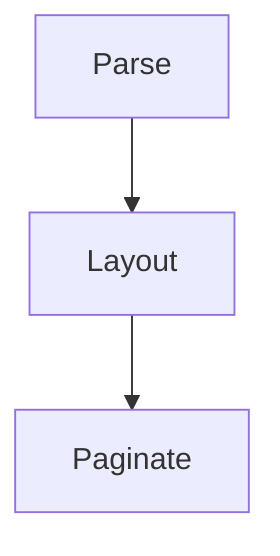

# Modern agent update

The **completed** change supersedes ~~the old approach~~. See
https://github.com/dstoc/sony-prs and www.example.com for follow-up details.
An email autolink is also useful: <reader@example.com>.

- [x] Preserve checked work
- [ ] Keep the unchecked follow-up

> [!NOTE] Reader policy
> Alerts keep their title and body visible on the device.

> [!WARNING]
> A long warning remains readable when it crosses a page boundary.

The source cites a footnote[^reader].

[^reader]: Footnotes remain ordinary readable text when no back-link action is available.

Raw inline HTML such as <kbd>Ctrl</kbd> is shown as source text.

<div class="agent-output">
Raw block HTML is shown as source text too.
</div>



```math
E = mc^2
```
