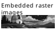

# PRS-T1 browser demo

This checked-in library exercises the same directory snapshot path as a
user-selected reader library.

Start with the [linked chapter](guide/chapter.md#details), visit the
[field notes](guide/notes.md), and use **Back** to return to the exact place
where a link was opened. The [PRS project](https://github.com/dstoc/sony-prs)
is an external link; the browser reports it instead of navigating away.

## Page turns

The demo entry point deliberately contains enough prose to make pagination
observable. Use Next and Previous, the left and right halves of the canvas, or
the matching keyboard shortcuts. The logical reader surface remains 600 by
800 pixels at every CSS display size.

This content is intentionally plain and deterministic. It gives the simulator
a stable page to render in local development and in the lightweight browser
contract checks.

The selected-directory and demo workflows both pass root-relative bytes to the
same Rust `BrowserResourceProvider`. JavaScript does not parse Markdown or
maintain a second navigation state.

The image above is also a real asset in the fixture. The linked chapter uses
the same asset through a different relative path, which checks that image
resolution follows the containing Markdown document.

Resize the browser window after opening a link and the reader should retain
its document and page state. CSS changes the canvas display rectangle only;
Rust continues to receive logical 600 by 800 coordinates.

The Home control follows the fixture's README entry point. Back follows reader
history, while a failed or external reference stays inside the simulator.

## More content

This final section makes the entry page span multiple pages in the shared
renderer. It also makes a clean page-turn boundary available to manual checks
without depending on browser timing or network resources.
